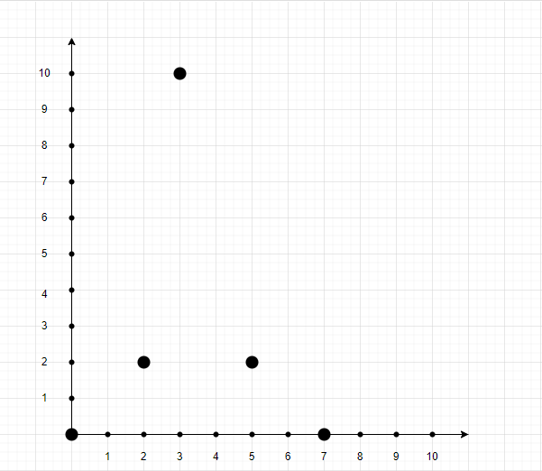
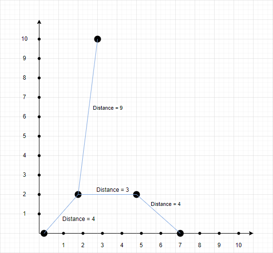

# Дополнительная работа - применение алгоритма Прима

## Описание задачи:
Дан массив точек `points`, который отражает положение координат на 2D оси: `points[i]` = [xi, yi]
Расстояние между точками [xi, yi] и [xj, yj] определяется формулой: |xi - xj| + |yi - yj|
Найти путь соединения всех точек с минимальным расстоянием.

## Пример:
`points = [[0,0],[2,2],[3,10],[5,2],[7,0]]`

Решение:
`[0, 0] [2, 2] [5, 2] [7, 0] [3, 10]`

